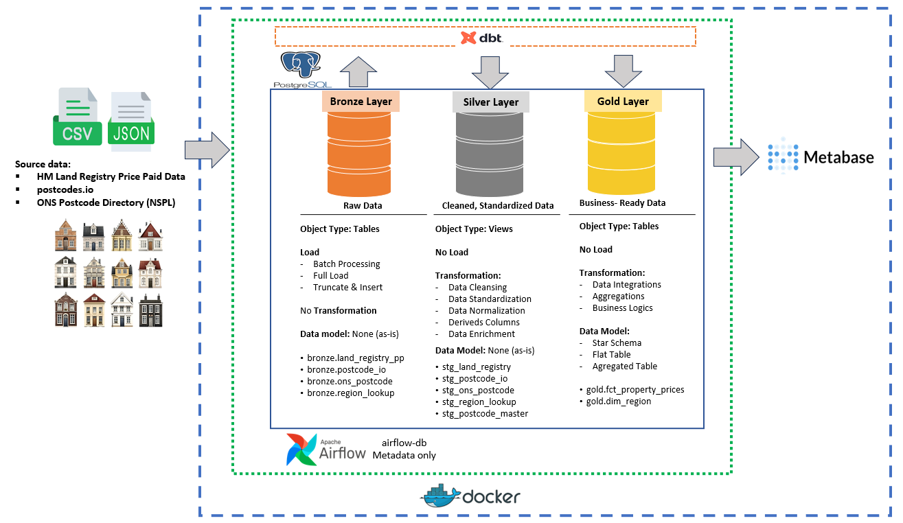
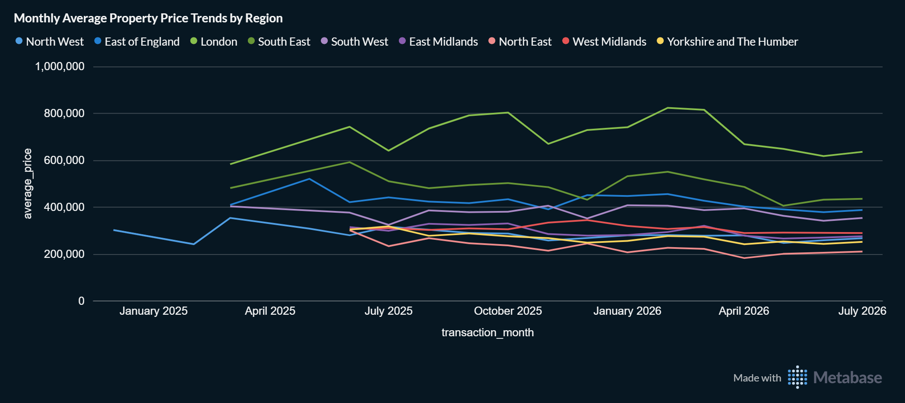
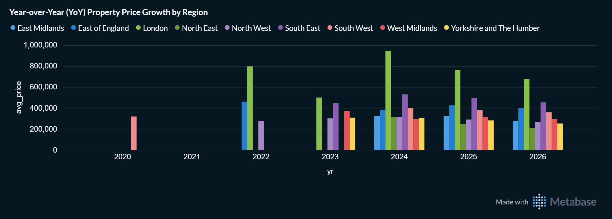
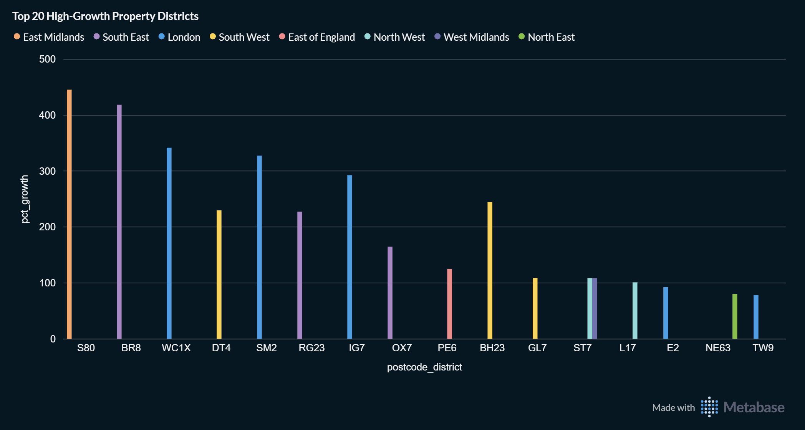

# UK Property Data Pipeline (Estate)

A zero-cost, on-premise, end-to-end data engineering pipeline for UK residential property price data — built to demonstrate medallion architecture, orchestration, transformation-as-code, data quality handling, and BI serving using a fully open-source stack.

---

## Project Overview

This project ingests UK property transaction data and postcode reference data from public, free sources, models it through a bronze → silver → gold medallion architecture using dbt, and  serves the result through a self-hosted BI tool (Metabase). Everything runs locally via Docker Compose — there is no cloud dependency and no recurring cost.

The pipeline demonstrates a realistic, small-scale version of a production data platform: scheduled ingestion, a raw/unmodified bronze layer, typed and cleaned silver models, a reconciled dimension built from two overlapping geographic sources, explicit handling of source-data quality issues, and an analytics layer a non-technical stakeholder could query through dashboards.

## Dataset Description

Three public UK datasets are combined:

| Dataset | Publisher | Update frequency | Access |
|---|---|---|---|
| Price Paid Data (PPD) | HM Land Registry | Monthly (rolling update) | Free bulk CSV, no auth |
| Postcode lookup | postcodes.io | Live API | Free bulk lookup API, no key |
| Postcode directory (NSPL) | Office for National Statistics (ONS) | Periodic (~quarterly) | Free bulk CSV (zip), no key |

Price Paid Data provides the transactional record (what sold, for how much, when, and its postcode). The two postcode sources provide geographic enrichment (region, local authority, latitude/longitude) and are deliberately overlapping: ONS NSPL is treated as the authoritative government reference and takes precedence, with postcodes.io used as a fallback for any postcode ONS doesn't resolve.

**Note on the Land Registry source file:** `pp-monthly-update-new-version.csv`
is a *rolling* update — it can include amendments to historical transactions going back decades, not just new sales from the current month. Seeing transaction dates spanning many years in a single download is expected, not a bug.

## Business Questions Addressed

This pipeline is designed to answer real property-market questions,
not just move data:

1. **Market trend & price index** — how have property prices moved
   month over month and year over year, by region?

2. **Investment hotspot / undervalued area detection** — which postcode
   districts show the fastest price appreciation over time?
3. **Geographic market segmentation** — how do prices and volumes differ
   across regions and administrative geographies?

(A fourth common use case — automated property valuation / AVM — is
explicitly **not** addressed here: HM Land Registry PPD contains no
property size/floor-area data, which an AVM requires. See Future Work.)

## Data Dictionary

**`bronze.land_registry_pp`** — one row per property transaction, loaded as-is from the source file (no filtering applied at ingestion time)

| Column | Type | Description |
|---|---|---|
| transaction_id | text | Unique ID for the transaction |
| price | numeric | Sale price, GBP, as recorded by HM Land Registry |
| date_of_transfer | date | Date the transfer was completed |
| postcode | text | Property postcode |
| property_type | char(1) | D=Detached, S=Semi-detached, T=Terraced, F=Flat/Maisonette, O=Other |
| old_new | char(1) | Y=Newly built, N=Established |
| duration | char(1) | F=Freehold, L=Leasehold |
| paon / saon | text | Primary/secondary addressable object name (house number/unit) |
| street, locality, town_city, district, county | text | Address components |
| ppd_category_type | char(1) | A=Standard entry, B=Additional entry (portfolio/bulk/non-market transactions — often extreme outlier prices) |
| record_status | char(1) | A=Addition, C=Change, D=Delete |

**`bronze.postcode_io`** — one row per postcode, from postcodes.io

| Column | Type | Description |
|---|---|---|
| postcode | text | Postcode |
| latitude / longitude | double | Coordinates |
| region, admin_district | text | Administrative geography (human-readable names) |

**`bronze.ons_postcode`** — one row per postcode, from the ONS NSPL (combined UK file, ~2.7M rows including historical/terminated postcodes)

| Column | Type | Description |
|---|---|---|
| postcode | text | Postcode |
| status | text | Termination date (YYYYMM); null = still live |
| latitude / longitude | double | Coordinates |
| region_code, lad_code | text | Administrative geography, as **codes only** (e.g. `E12000007`) — NSPL never provides human-readable names |
| lsoa_code, msoa_code | text | Statistical output area codes |

**`bronze.region_lookup`** — ONS region code → human-readable name mapping, extracted from the same NSPL zip's `Documents/` folder (since NSPL's main file only ever provides codes)

**`gold.fct_property_prices`** — grain: one row per transaction

| Column | Description |
|---|---|
| transaction_id | Unique transaction identifier |
| price, transaction_date, transaction_month | Sale facts |
| is_price_outlier | `true` if `price > 10,000,000` — flags likely data-entry errors or non-market bulk transactions in the source, without silently dropping the row |
| property_type, ppd_category_type, postcode | Transaction attributes |
| region, admin_district, latitude, longitude | Enriched from the reconciled postcode model, with `region` translated to a readable name via `region_lookup` |
| postcode_source | Which source resolved the postcode: `ons` or `postcodes_io` |

**`gold.dim_region`** — distinct regions/admin districts for dashboard filters.

## Pipeline Architecture



- **Sources**: HM Land Registry Price Paid Data (CSV), postcodes.io (REST API/JSON), ONS Postcode Directory/NSPL (CSV in zip)
- **Orchestration**: Apache Airflow schedules and coordinates ingestion and transformation tasks
- **Extract & Load**: raw data lands **as-is** in the bronze schema of a single PostgreSQL instance — no cleaning, no type casting, no filtering at ingestion time. Each run **truncates and reloads** the target table (not drop+recreate), which keeps downstream dbt views/tables intact instead of breaking on `DependentObjectsStillExist`
- **Transform**: dbt-core reads from bronze and builds:
  - **silver** — cleaned, typed staging models (`stg_land_registry`, `stg_postcode_io`, `stg_ons_postcode`, `stg_region_lookup`, `stg_postcode_master`) — this is the *only* layer where nulls are filtered and types are cast
  - **gold** — analytics-ready marts (`gold.fct_property_prices`, `gold.dim_region`)
- **Single warehouse**: bronze, silver, and gold are schemas within the *same* Postgres instance — not separate databases. A custom `generate_schema_name` dbt macro ensures models land in exactly `silver`/`gold`, not dbt's default `bronze_silver`/`bronze_gold` naming
- **Metadata isolation**: Airflow's own scheduling/run history lives in a separate `airflow-db` instance, isolated from the data warehouse
- **Serving**: Metabase connects to the gold schema for BI dashboards and reporting. Metabase's own app data (dashboards, questions, users) persists in a named Docker volume, so it survives container restarts without re-running the setup wizard each time
- **Infrastructure**: every component — Airflow, Postgres, dbt, Metabase — runs as a containerized service in a single Docker Compose stack. The Airflow container runs as the host user's UID (via `AIRFLOW_UID`) so it can write into bind-mounted project folders without permission conflicts

## Modern Data Stack

| Layer | Tool | Notes |
|---|---|---|
| Orchestration | Apache Airflow 2.9.3 (Docker, LocalExecutor) | DAG-based dependency management |
| Containerization | Docker Compose, custom Airflow image (`Dockerfile.airflow`) | `PYTHONPATH` set at the container level so ingestion modules import cleanly, no `sys.path` hacks in DAG code |
| Storage / warehouse | PostgreSQL 16 | Schema-based medallion separation (bronze/silver/gold) |
| Transformation | dbt-core 1.8.2 + dbt-postgres 1.8.2 (explicitly pinned together) | `dbt deps` runs once during `airflow-init`, not on every DAG execution |
| BI / serving | Metabase, pinned to `v0.58.34` (LTS, security support through Feb 2027) | Chosen deliberately after checking metabase.com/version-support — not `latest`, for reproducibility |
| Python deps | pandas 2.1.4, SQLAlchemy 1.4.51 (both pinned together — pandas ≥2.2 requires SQLAlchemy ≥2.0, which conflicts with dbt 1.8.x's SQLAlchemy <2.0 requirement) | |

## Dashboards

Four saved Metabase questions answer the business questions above,
built against `gold.fct_property_prices`:

**1. Monthly Average Property Price Trends by Region** — month-over-month average price per region, as a line chart. Applies a `txn_count >= 30` floor per (region, month) to avoid a single high-value sale dominating a low-volume month's average.
<br>


**2. Year-over-Year (YoY) Property Price Growth by Region** — annual average price per region with `LAG()`-based YoY % change, as a bar chart. Same `txn_count` floor applied per year.
<br>


**3. Top 20 High-Growth Property Districts** — postcode-district-level price growth between each district's first and most recent year with sufficient data (`txn_count >= 5` per year), ranked by % growth.
<br>


**Note on Data Maturity** (shown on the dashboard itself): these charts apply minimum transaction-count thresholds to reduce noise from single-sale periods. With only a limited window of Land Registry data currently loaded, some regions/districts don't yet have enough
transactions for a statistically stable average, and thresholds are a stopgap — not a permanent substitute for more historical data (see Future Work).

## Project Folder Structure

```
uk-property-pipeline/
├── .env.example
├── .gitignore
├── Dockerfile.airflow
├── README.md
├── requirements.txt
├── docker-compose.yml
├── estate-architecture.png
├── docker/
│   └── init.sql                     # schemas + grants only -- no table DDL (bronze tables are created dynamically by ingestion scripts)
├── airflow/
│   └── dags/
│       └── property_pipeline_dag.py
├── ingestion/
│   ├── db.py                        # shared Postgres connection helper
│   ├── land_registry.py             # -> bronze.land_registry_pp
│   ├── postcodes.py                 # -> bronze.postcode_io
│   └── ons_postcode.py              # -> bronze.ons_postcode + bronze.region_lookup
└── dbt/
    ├── dbt_project.yml
    ├── profiles.yml
    ├── packages.yml
    ├── package-lock.yml
    ├── macros/
    │   └── get_custom_schema.sql    # forces models into silver/gold, not bronze_silver/bronze_gold
    └── models/
        ├── staging/                 # silver
        │   ├── sources.yml
        │   ├── stg_land_registry.sql
        │   ├── stg_postcode_io.sql
        │   ├── stg_ons_postcode.sql
        │   ├── stg_region_lookup.sql
        │   └── stg_postcode_master.sql
        └── marts/                   # gold
            ├── schema.yml
            ├── dim_region.sql
            └── fct_property_prices.sql
```

## Execution Steps & Final Configuration

```bash
git clone <this-repo>
cd uk-property-pipeline
cp .env.example .env
```

Fill in `.env`:
- `POSTGRES_USER`, `POSTGRES_PASSWORD`, `POSTGRES_DB` — warehouse credentials
- `AIRFLOW__CORE__FERNET_KEY` — generate with:
  `python -c "from cryptography.fernet import Fernet; print(Fernet.generate_key().decode())"`
- `AIRFLOW__WEBSERVER__SECRET_KEY` — generate with:
  `python3 -c "import secrets; print(secrets.token_hex(16))"`
- `AIRFLOW_UID` — set to your host user's UID: `echo "AIRFLOW_UID=$(id -u)" >> .env`
- `NSPL_SOURCE_URL` — current NSPL download link from the
  [ONS Open Geography Portal](https://geoportal.statistics.gov.uk) (this
  link changes between releases and points to a `.zip`, not a raw CSV)

Build and start everything:

```bash
docker compose up -d --build
```

- **Airflow UI**: http://localhost:8080 (`admin` / `admin`)
- **Metabase**: http://localhost:3000 — on first run, complete the setup
  wizard and connect it to the `postgres` service using the credentials
  from `.env`; build dashboards against the `gold` schema only. Metabase's
  setup only needs to be done once — its data persists in a named volume
  across restarts
- Trigger the `uk_property_pipeline` DAG from the Airflow UI to run the
  full ingestion → transform flow. `dbt deps` runs once automatically
  during `airflow-init`, not as part of every DAG run

## Future Work & Scalability

- **Historical backfill**: currently ingesting only the rolling monthly
  Land Registry update. Backfilling the full historical PPD file would
  give month-level and district-level averages enough transaction volume
  to be reliable without the current `txn_count` thresholds.
- **CI/CD**: add a GitHub Actions workflow running `dbt run`/`dbt test`
  against a throwaway Postgres service container on every push.
- **Incremental models**: convert `fct_property_prices` to an
  incremental dbt model, using `transaction_id` + `record_status` for
  proper upsert handling, rather than a full truncate-and-reload each run.
- **AVM / property valuation**: would require a genuinely new data
  source with floor-area data (e.g. EPC — Energy Performance
  Certificates, also free/open) plus address-level matching to Land
  Registry, since PPD alone has no size data to compute price-per-sqm.
- **Cloud portability**: the medallion design (bronze/silver/gold
  schemas, dbt models referencing `source()`/`ref()`) would migrate with
  minimal change to a managed warehouse if this ever needed to scale
  past a single on-premise instance.
- **Monitoring**: add Prometheus + Grafana for pipeline health metrics
  (task duration, success rate) beyond Airflow's built-in logging.

## Acknowledgements

- [HM Land Registry](https://www.gov.uk/government/collections/price-paid-data) — Price Paid Data, released under the Open Government Licence.
- [Office for National Statistics](https://www.ons.gov.uk/) — NSPL postcode directory, released under the Open Government Licence.
- [postcodes.io](https://postcodes.io/) — free, open-source postcode lookup API.
- Built with Apache Airflow, dbt, PostgreSQL, and Metabase — all open-source projects.
