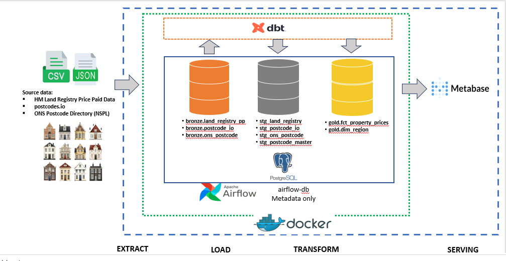

# UK Property Data Pipeline (Estate)

A zero-cost, on-premise, end-to-end data engineering pipeline for UK
residential property price data — this project to
demonstrate medallion architecture, orchestration, transformation-as-code,
data quality testing, and BI serving using a fully open-source stack.

---

## Project Overview

This project ingests UK property transaction data and postcode reference
data from public, free sources, models it through a bronze → silver → gold
medallion architecture using dbt, and serves the result through a
self-hosted BI tool (Metabase). Everything runs locally via Docker
Compose — there is no cloud dependency and no recurring cost.

The goal of the project is to show a realistic, small-scale version of a
production data platform: scheduled ingestion, a documented raw layer,
tested transformations, a reconciled dimension built from two overlapping
sources, and an analytics layer that a non-technical stakeholder could
query through a dashboard.

## Dataset Description

Three public UK datasets are combined:

| Dataset | Publisher | Update frequency | Access |
|---|---|---|---|
| Price Paid Data (PPD) | HM Land Registry | Monthly | Free bulk CSV, no auth |
| Postcode lookup | postcodes.io | Live API | Free bulk lookup API, no key |
| Postcode directory (NSPL) | Office for National Statistics (ONS) | Periodic (~quarterly) | Free bulk CSV, no key |

Price Paid Data provides the transactional record (what sold, for how
much, when, and its postcode). The two postcode sources provide
geographic enrichment (region, local authority, latitude/longitude) and
are deliberately overlapping: postcodes.io is used as the primary,
easy to query source, while the ONS NSPL is treated as the more
authoritative government reference and takes precedence wherever both
resolve the same postcode.

## Data Dictionary

**`bronze.land_registry_pp`** — one row per property transaction

| Column | Type | Description |
|---|---|---|
| transaction_id | text | Unique ID for the transaction |
| price | integer | Sale price, GBP |
| date_of_transfer | date | Date the transfer was completed |
| postcode | text | Property postcode |
| property_type | char(1) | D=Detached, S=Semi-detached, T=Terraced, F=Flat/Maisonette, O=Other |
| old_new | char(1) | Y=Newly built, N=Established |
| duration | char(1) | F=Freehold, L=Leasehold |
| paon / saon | text | Primary/secondary addressable object name (house number/unit) |
| street, locality, town_city, district, county | text | Address components |
| ppd_category_type | char(1) | A=Standard entry, B=Additional entry |
| record_status | char(1) | A=Addition, C=Change, D=Delete |

**`bronze.postcode_io`** — one row per postcode, from postcodes.io

| Column | Type | Description |
|---|---|---|
| postcode | text (PK) | Postcode |
| latitude / longitude | double | Coordinates |
| region, admin_district, admin_county, admin_ward | text | Administrative geography |
| lsoa / msoa | text | Statistical output areas |
| parliamentary_constituency, ccg, nuts | text | Additional geographic/administrative codes |

**`bronze.ons_postcode`** — one row per postcode, from the ONS NSPL

| Column | Type | Description |
|---|---|---|
| postcode | text (PK) | Postcode |
| status | text | 1=Live, 0=Terminated |
| latitude / longitude | double | Coordinates |
| region_code / region_name | text | Region |
| lad_code / lad_name | text | Local authority district |
| lsoa_code / msoa_code | text | Statistical output areas |

**`gold.fct_property_prices`** — grain: one row per transaction

| Column | Description |
|---|---|
| transaction_id | Unique transaction identifier |
| price, transaction_date, transaction_month | Sale facts |
| property_type, postcode | Transaction attributes |
| region, admin_district, latitude, longitude | Enriched from the reconciled postcode model |
| postcode_source | Which source resolved the postcode: `ons` or `postcodes_io` |

**`gold.dim_region`** — distinct regions/admin districts for dashboard filters.

## Problem Statement & Key Research Questions

Property price movement in the UK is publicly reported at a national
level, but Price Paid Data alone has no usable geography beyond a raw
postcode string, it can't answer regional questions without being joined
to a geographic reference. This project addresses that gap and aims to
answer:

- How have property prices moved month over month within a given region?
- Which regions or local authorities show the fastest price growth?
- Does property type (detached, terraced, flat, etc.) affect price trends differently across regions?
- How reliable is postcode-based geographic enrichment when two independent sources (ONS vs. postcodes.io) are compared, and how often do they disagree?

## Pipeline Architecture



<br>

## Modern Data Stack

| Layer | Tool | Why |
|---|---|---|
| Orchestration | Apache Airflow 2.9.1 (LocalExecutor) | Industry-standard scheduler; DAG-based dependency management |
| Containerization | Docker Compose | Reproducible, one-command local environment |
| Storage / warehouse | PostgreSQL 16 | Free, robust, supports schema-based medallion separation |
| Transformation | dbt-core (dbt-postgres) | Transformation-as-code, testable, version-controlled SQL |
| Data quality | dbt tests + dbt_utils | Declarative `unique`/`not_null`/`accepted_values` checks as a pipeline gate |
| BI / serving | Metabase | Free, self-hosted, connects directly to the gold schema |
| CI | (planned — see Future Work) | Automated `dbt test` on every push |

## Project Folder Structure

```
uk-property-pipeline/
├── .env.example
├── .gitignore
├── Dockerfile.airflow
├── README.md
├── requirements.txt
├── docker-compose.yml
├── docker/
│   └── init.sql                     # bronze DDL: schemas + 3 raw tables + indexes
├── airflow/
│   └── dags/
│       └── property_pipeline_dag.py
├── ingestion/
│   ├── db.py                        # shared Postgres connection helper
│   ├── land_registry.py             # -> bronze.land_registry_pp
│   ├── postcodes.py                 # -> bronze.postcode_io
│   └── ons_postcode.py              # -> bronze.ons_postcode
└── dbt/
    ├── dbt_project.yml
    ├── profiles.yml
    ├── packages.yml
    └── models/
        ├── staging/                 # silver
        │   ├── sources.yml          # source + column-level tests
        │   ├── stg_land_registry.sql
        │   ├── stg_postcode_io.sql
        │   ├── stg_ons_postcode.sql
        │   └── stg_postcode_master.sql
        └── marts/                   # gold
            ├── schema.yml
            ├── dim_region.sql
            └── fct_property_prices.sql
```

## Execution Steps & Final Configuration

```bash
git clone <this-repo>
cd uk-property-pipeline
cp .env.example .env
```

Fill in `.env`:
- `POSTGRES_USER`, `POSTGRES_PASSWORD`, `POSTGRES_DB` — warehouse credentials
- `AIRFLOW__CORE__FERNET_KEY` — generate with:
  `python -c "from cryptography.fernet import Fernet; print(Fernet.generate_key().decode())"`
- `NSPL_SOURCE_URL` — current NSPL CSV download link from the
  [ONS Open Geography Portal](https://geoportal.statistics.gov.uk) (this
  link changes between ONS releases and has no permanent URL)

Build and start everything:

```bash
docker compose up -d --build
```

- **Airflow UI**: http://localhost:8080 (`admin` / `admin`)
- **Metabase**: http://localhost:3000 — on first run, connect it to the
  `postgres` service using the credentials from `.env`, and build
  dashboards against the `gold` schema only
- Trigger the `uk_property_pipeline` DAG from the Airflow UI to run the
  full ingestion → transform → test flow

## Future Work & Scalability

- **CI/CD**: add a GitHub Actions workflow running `dbt run`/`dbt test`
  against a throwaway Postgres service container on every push.
- **Historical backfill**: Land Registry publishes a full historical
  bulk file in addition to the monthly update — extending ingestion to
  backfill would allow multi-year trend analysis instead of just the
  current month.
- **Incremental models**: convert `fct_property_prices` to an
  incremental dbt model rather than a full rebuild as data volume grows.
- **Great Expectations**: layer in richer data quality checks (value
  distributions, outlier detection on price) beyond dbt's built-in tests.
- **Cloud portability**: the medallion design (bronze/silver/gold schemas,
  dbt models referencing `source()`/`ref()`) would migrate with minimal
  change to a managed warehouse (e.g. swapping the Postgres connection
  for Snowflake/BigQuery) if this ever needed to scale past a single
  on-premise instance.
- **Monitoring**: add Prometheus + Grafana for pipeline health metrics
  (task duration, success rate) beyond Airflow's built-in logging.

## Acknowledgements

- [HM Land Registry](https://www.gov.uk/government/collections/price-paid-data) — Price Paid Data, released under the Open Government Licence.
- [Office for National Statistics](https://www.ons.gov.uk/) — NSPL postcode directory, released under the Open Government Licence.
- [postcodes.io](https://postcodes.io/) — free, open-source postcode lookup API.
- Built with Apache Airflow, dbt, PostgreSQL, and Metabase — all open-source projects.
