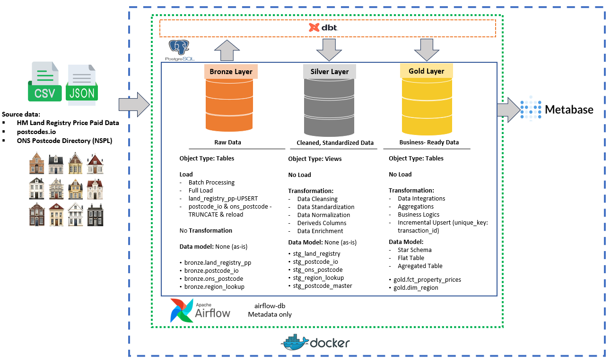
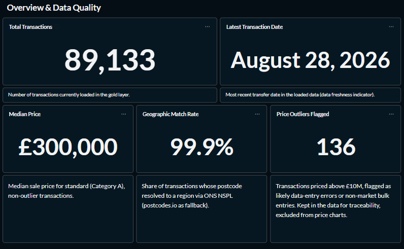

# UK Property Data Pipeline (Estate)

A zero-cost, on-premise, end-to-end data engineering pipeline for UK residential property price data — built to demonstrate medallion architecture, orchestration, transformation-as-code, data quality handling, and BI serving using a fully open-source stack.

---

## Project Overview

This project ingests UK property transaction data and postcode reference data from public, free sources, models it through a bronze → silver → gold medallion architecture using dbt, and serves the result through a self-hosted BI tool (Metabase). Everything runs locally via Docker Compose — there is no cloud dependency and no recurring cost.

The pipeline demonstrates a realistic, small-scale version of a production data platform: scheduled ingestion, a raw/unmodified bronze layer, typed and cleaned silver models, a reconciled dimension built from two overlapping geographic sources, explicit handling of source-data quality issues, and an analytics layer a non-technical stakeholder could query through dashboards.

## Dataset Description

Three public UK datasets are combined:

|    Dataset   |    Publisher    |    Update frequency    |    Access    |
|--------------|------------------|-----------|---------------------------|
| Price Paid Data (PPD) | HM Land Registry | Monthly update file (published on the 20th working day) | Free bulk CSV, no auth |
| Postcode lookup | postcodes.io | Live API | Free bulk lookup API, no key |
| Postcode directory (NSPL) | Office for National Statistics (ONS) | Periodic (~quarterly) | Free bulk CSV (zip), no key |

Price Paid Data provides the transactional record (what sold, for how much, when, and its postcode). The two postcode sources provide geographic enrichment (region, local authority, latitude/longitude) and are deliberately overlapping: ONS NSPL is treated as the authoritative government reference and takes precedence, with postcodes.io used as a fallback for any postcode ONS doesn't resolve.

**Note on the Land Registry source file:** `pp-monthly-update-new-version.csv`
is a *rolling* update — it can include amendments to historical transactions going back decades, not just new sales from the current month. Seeing transaction dates spanning many years in a single download is expected, not a bug.

## Business Questions Addressed

This pipeline is designed to answer real property-market questions, not just move data. Each question maps to a section of the [dashboard](dashboard.md):

| # | Business question | Dashboard section |
|---|---|---|
| 1 | How have property prices moved month over month, by region? | 2.1 Monthly price trends |
| 2 | Which postcode districts have shown the strongest historical price appreciation? | 2.2 Top 10 districts by CAGR |
| 3 | How do prices, transaction activity, and housing mix differ across regions? | 3.1 to 3.3 Market Segmentation |
| 4 | Can the data be trusted? (freshness, geographic match rate, flagged outliers) | 1. Overview and Data Quality |

## Data Dictionary

**`bronze.land_registry_pp`** — one row per property transaction, loaded as-is from the source file (no filtering applied at ingestion time)

| Column | Type | Description |
|---|---|---|
| transaction_id | text | Unique ID for the transaction |
| price | numeric | Sale price, GBP, as recorded by HM Land Registry |
| date_of_transfer | date | Date the transfer was completed |
| postcode | text | Property postcode |
| property_type | char(1) | D=Detached, S=Semi-detached, T=Terraced, F=Flat/Maisonette, O=Other |
| old_new | char(1) | Y=Newly built, N=Established |
| duration | char(1) | F=Freehold, L=Leasehold |
| paon / saon | text | Primary/secondary addressable object name (house number/unit) |
| street, locality, town_city, district, county | text | Address components |
| ppd_category_type | char(1) | A=Standard entry, B=Additional entry (portfolio/bulk/non-market transactions — often extreme outlier prices) |
| record_status | char(1) | A=Addition, C=Change, D=Delete |

**`bronze.postcode_io`** — one row per postcode, from postcodes.io

| Column | Type | Description |
|---|---|---|
| postcode | text | Postcode |
| latitude / longitude | double | Coordinates |
| region, admin_district | text | Administrative geography (human-readable names) |

**`bronze.ons_postcode`** — one row per postcode, from the ONS NSPL (combined UK file, ~2.7M rows including historical/terminated postcodes)

| Column | Type | Description |
|---|---|---|
| postcode | text | Postcode |
| status | text | Termination date (YYYYMM); null = still live |
| latitude / longitude | double | Coordinates |
| region_code, lad_code | text | Administrative geography, as **codes only** (e.g. `E12000007`) — NSPL never provides human-readable names |
| lsoa_code, msoa_code | text | Statistical output area codes |

**`bronze.region_lookup`** — ONS region code → human-readable name mapping, extracted from the same NSPL zip's `Documents/` folder (since NSPL's main file only ever provides codes)

**`gold.fct_property_prices`** — grain: one row per transaction

| Column | Description |
|---|---|
| transaction_id | Unique transaction identifier |
| price, transaction_date, transaction_month | Sale facts |
| is_price_outlier | `true` if `price > 10,000,000` — flags likely data-entry errors or non-market bulk transactions in the source, without silently dropping the row |
| property_type, ppd_category_type, postcode | Transaction attributes |
| region, admin_district, latitude, longitude | Enriched from the reconciled postcode model, with `region` translated to a readable name via `region_lookup` |
| postcode_source | Which source resolved the postcode: `ons` or `postcodes_io` |

**`gold.dim_region`** — distinct regions/admin districts for dashboard filters.

## Pipeline Architecture



- **Sources**: HM Land Registry Price Paid Data (CSV), postcodes.io (REST API/JSON), ONS Postcode Directory/NSPL (CSV in zip)
- **Orchestration**: Apache Airflow schedules and coordinates ingestion and transformation tasks
- **Extract & Load**: raw data lands **as-is** in the bronze schema of a single PostgreSQL instance — no cleaning, no type casting, no filtering at ingestion time. 
  - `postcode_io` and `ons_postcode` (reference/dimension data, not time-series) use **truncate-and-reload** per run.
  - `land_registry_pp` (transactional fact data) uses **UPSERT on `transaction_id`** (v1.0+), since the monthly update file is not a cumulative history — truncate-and-reload would cause historical data to be silently discarded between runs (see Version History).
- **Transform**: dbt-core reads from bronze and builds:
  - **silver** — cleaned, typed staging models (`stg_land_registry`, `stg_postcode_io`, `stg_ons_postcode`, `stg_region_lookup`, `stg_postcode_master`) — this is the *only* layer where nulls are filtered and types are cast
  - **gold** — analytics-ready marts (`gold.fct_property_prices`, `gold.dim_region`)
- **Single warehouse**: bronze, silver, and gold are schemas within the *same* Postgres instance — not separate databases. A custom `generate_schema_name` dbt macro ensures models land in exactly `silver`/`gold`, not dbt's default `bronze_silver`/`bronze_gold` naming
- **Metadata isolation**: Airflow's own scheduling/run history lives in a separate `airflow-db` instance, isolated from the data warehouse
- **Serving**: Metabase connects to the gold schema for BI dashboards and reporting. Metabase's own app data (dashboards, questions, users) persists in a named Docker volume, so it survives container restarts without re-running the setup wizard each time
- **Infrastructure**: every component — Airflow, Postgres, dbt, Metabase — runs as a containerized service in a single Docker Compose stack. The Airflow container runs as the host user's UID (via `AIRFLOW_UID`) so it can write into bind-mounted project folders without permission conflicts

## Modern Data Stack

| Layer | Tool | Notes |
|---|---|---|
| Orchestration | Apache Airflow 2.9.3 (Docker, LocalExecutor) | DAG-based dependency management |
| Containerization | Docker Compose, custom Airflow image (`Dockerfile.airflow`) | `PYTHONPATH` set at the container level so ingestion modules import cleanly, no `sys.path` hacks in DAG code |
| Storage / warehouse | PostgreSQL 16 | Schema-based medallion separation (bronze/silver/gold) |
| Transformation | dbt-core 1.8.2 + dbt-postgres 1.8.2 | `fct_property_prices` uses incremental materialization with `unique_key='transaction_id'` (v1.0+) |
| BI / serving | Metabase, pinned to `v0.58.34` (LTS, security support through Feb 2027) | Chosen deliberately after checking metabase.com/version-support — not `latest`, for reproducibility |
| Python deps | pandas 2.1.4, SQLAlchemy 1.4.51 (both pinned together — pandas ≥2.2 requires SQLAlchemy ≥2.0, which conflicts with dbt 1.8.x's SQLAlchemy <2.0 requirement) | |

## Dashboards



For complete information regarding metrics, queries, and visualizations, see the [Dashboard Documentation](dashboard.md).


## Project Folder Structure

```
uk-property-pipeline/
├── .env.example
├── .gitignore
├── Dockerfile.airflow
├── README.md
├── dashboard.md
├── requirements.txt
├── docker-compose.yml
├── doc/
│   ├── 01-overview-data-quality.png
│   ├── 02-monthly-price-trend.png
│   ├── 03-top-10-districts-cagr.png
│   ├── 04-median-price-by-property-type.png
│   ├── 05-transaction-volume.png
│   ├── 06-property-type-mix.png
│   └── architecture.png
├── docker/
│   └── init.sql                     # schemas + grants only -- no table DDL (bronze tables are created dynamically by ingestion scripts)
├── airflow/
│   └── dags/
│       └── property_pipeline_dag.py
├── ingestion/
│   ├── db.py                        # shared Postgres connection helper
│   ├── land_registry.py             # -> bronze.land_registry_pp
│   ├── postcodes.py                 # -> bronze.postcode_io
│   └── ons_postcode.py              # -> bronze.ons_postcode + bronze.region_lookup
└── dbt/
    ├── dbt_project.yml
    ├── profiles.yml
    ├── packages.yml
    ├── package-lock.yml
    ├── macros/
    │   └── get_custom_schema.sql    # forces models into silver/gold, not bronze_silver/bronze_gold
    └── models/
        ├── staging/                 # silver
        │   ├── sources.yml
        │   ├── stg_land_registry.sql
        │   ├── stg_postcode_io.sql
        │   ├── stg_ons_postcode.sql
        │   ├── stg_region_lookup.sql
        │   └── stg_postcode_master.sql
        └── marts/                   # gold
            ├── schema.yml
            ├── dim_region.sql
            └── fct_property_prices.sql
```

## Execution Steps & Final Configuration

```bash
git clone <this-repo>
cd uk-property-pipeline
cp .env.example .env
```

Fill in `.env`:
- `POSTGRES_USER`, `POSTGRES_PASSWORD`, `POSTGRES_DB` — warehouse credentials
- `AIRFLOW__CORE__FERNET_KEY` — generate with:
  `python -c "from cryptography.fernet import Fernet; print(Fernet.generate_key().decode())"`
- `AIRFLOW__WEBSERVER__SECRET_KEY` — generate with:
  `python3 -c "import secrets; print(secrets.token_hex(16))"`
- `AIRFLOW_UID` — set to your host user's UID: `echo "AIRFLOW_UID=$(id -u)" >> .env`
- `NSPL_SOURCE_URL` — current NSPL download link from the [ONS Open Geography Portal](https://geoportal.statistics.gov.uk) (this link changes between releases and points to a `.zip`, not a raw CSV)

Build and start everything:

```bash
docker compose up -d --build
```

- **Airflow UI**: http://localhost:8080 (`admin` / `admin`)
- **Metabase**: http://localhost:3000 — on first run, complete the setup wizard and connect it to the `postgres` service using the credentials from `.env`; build dashboards against the `gold` schema only. Metabase's setup only needs to be done once — its data persists in a named volume across restarts
- Trigger the `uk_property_pipeline` DAG from the Airflow UI to run the full ingestion → transform flow. `dbt deps` runs once automatically during `airflow-init`, not as part of every DAG run

## Version History

- **v0.1 — Baseline medallion pipeline.** Bronze layer used truncate-and-reload per ingestion run for all three sources; gold layer (`fct_property_prices`) used full-refresh (`table`) dbt materialization.
- **v1.0 — Incremental load with deduplication.** Converted Land Registry ingestion (`land_registry.py`) from truncate-and-reload to UPSERT, keyed on `transaction_id`. Converted `fct_property_prices` to an `incremental` dbt materialization with `unique_key='transaction_id'`.
  **Why:** production-style monitoring across two consecutive monthly runs revealed that the gold table's row count had *decreased* (101,334 → 90,612) instead of accumulating — because HM Land Registry’s monthly update file is not a cumulative history, truncate-and-reload was silently discarding historical transactions every run. This broke the time-series assumption behind the Monthly Trend and YoY Growth dashboards. `postcode_io` and `ons_postcode` (reference/dimension data, not transactional) retain truncate-and-reload, since they don't need historical accumulation.
- **v1.1 (planned):** Historical backfill from yearly Price Paid Data files, with enrichment scoped to postcodes not resolved by ONS.

## Future Work & Scalability

- **Historical backfill (planned v1.1):** The pipeline currently loads only HM Land Registry's monthly update file (the current month's transactions plus amendments to earlier releases), so earlier periods are thinly populated and the trend and growth views rely on minimum-sample thresholds. The plan is a one-off backfill from the yearly Price Paid Data files (115–230 MB each, starting with the last five years) through the existing UPSERT path, run outside the monthly DAG in insert-only mode so it never overwrites rows the monthly run has updated. Prerequisites: (1) incremental UPSERT load merged and verified, (2) postcodes.io enrichment restricted to postcodes missing from ONS, since ONS already resolves 99.9% of transactions, and (3) an `is_incremental()` filter on `fct_property_prices` so each run no longer rescans the full history. Afterwards, the Data Maturity notes and the YoY and CAGR views will be re-evaluated.
- **CI/CD**: add a GitHub Actions workflow running `dbt run`/`dbt test`  against a throwaway Postgres service container on every push.
- **AVM / property valuation**: would require a genuinely new data source with floor-area data (e.g. EPC — Energy Performance Certificates, also free/open) plus address-level matching to Land Registry, since PPD alone has no size data to compute price-per-sqm.
- **Cloud portability**: the medallion design (bronze/silver/gold schemas, dbt models referencing `source()`/`ref()`) would migrate with minimal change to a managed warehouse if this ever needed to scale past a single on-premise instance.
- **Monitoring**: add Prometheus + Grafana for pipeline health metrics (task duration, success rate) beyond Airflow's built-in logging.

## Acknowledgements

- [HM Land Registry](https://www.gov.uk/government/collections/price-paid-data) — Price Paid Data, released under the Open Government Licence.
- [Office for National Statistics](https://www.ons.gov.uk/) — NSPL postcode directory, released under the Open Government Licence.
- [postcodes.io](https://postcodes.io/) — free, open-source postcode lookup API.
- Built with Apache Airflow, dbt, PostgreSQL, and Metabase — all open-source projects.
