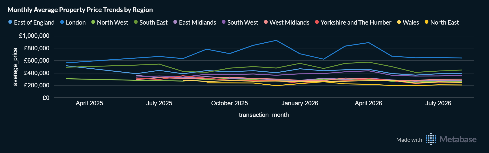
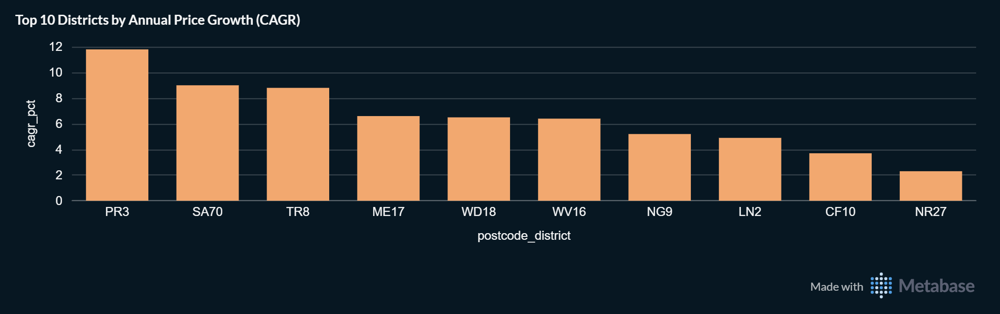
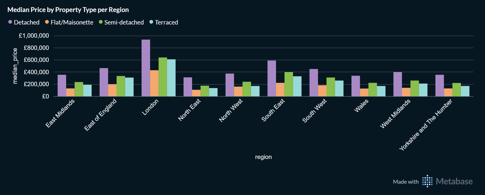
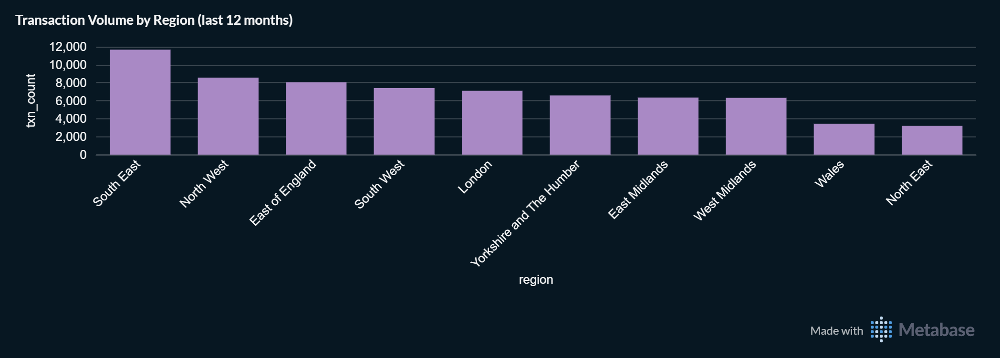
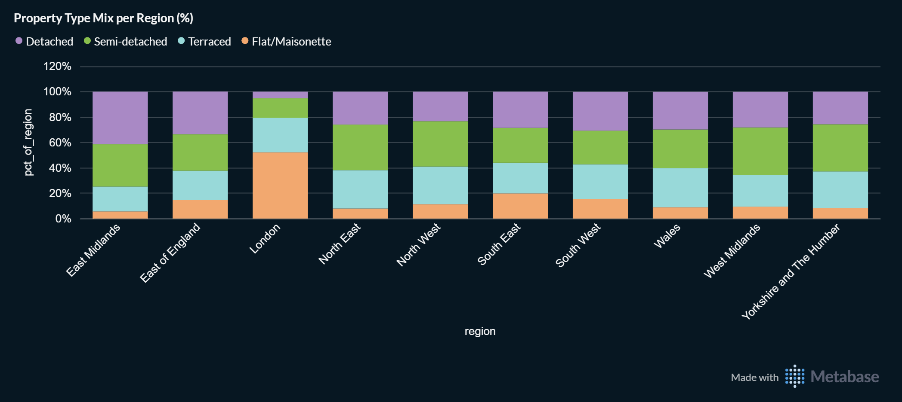

# UK Property Market Intelligence Dashboard
Built on HM Land Registry Price Paid Data, geographically enriched with ONS and postcodes.io reference data, transformed with dbt (bronze → silver → gold) and orchestrated by Airflow. All figures come from gold.fct_property_prices. Price views use standard (Category A) transactions only, with likely data-entry outliers (over £10M) excluded.

**Key findings** (snapshot as of 2026-10-08, figures change as the pipeline loads new months). Coverage is England and Wales, the jurisdiction of HM Land Registry.

- **Data scale and quality:** The gold layer holds 89,133 transactions dated up to August 2026, with a 99.9% geographic match rate. The median sale price for standard (Category A), non-outlier transactions is £300,000. Transactions above £10M are flagged as likely data-entry errors or bulk entries, retained for audit traceability, and excluded from price charts.
- **Regional price differences:** London has the highest prices in the data (detached median close to £1M) and a flat-heavy housing mix (about 52% of its standard transactions). Transaction counts are highest in the South East and North West, which largely reflects region size rather than market strength.
- **Growth districts:** Ranked by compound annual growth in average price, PR3 leads at over 11% per year between 2024 and 2026 (9 transactions in 2024, 55 in 2026; 2026 data runs only to August). With a two-year window and small samples at the start of it, the ranking is sensitive to individual sales. It reflects historical appreciation, not a forecast.

## Configuration
- Source: all cards read from `gold.fct_property_prices` only
- Layout: one dashboard with three tabs (Overview and Data Quality, Market Trends and Hotspots, Market Segmentation)
- Price columns formatted as GBP (Visualization settings, Style: Currency)
**Source scope:** The pipeline loads HM Land Registry's monthly update file (the current month's transactions plus updates to earlier releases), not the complete Price Paid history. Counts and averages therefore describe the records loaded so far, not total market activity, and earlier periods are thinly populated.

| Convention | Applied to |
|---|---|
| Category A transactions only | Sections 2 and 3, and the Median Price card |
| Price outliers (over £10M) excluded | Sections 2 and 3 |
| Rows without a resolved region excluded | Sections 2 and 3 |
| Minimum sample size | Monthly trend: 30 per region-month. CAGR: 5 per district-year. Price by type: 10 per group |

## 1.	Overview and Data Quality 


### 1.1. Total Transactions
Number of transactions currently loaded in the gold layer.

```sql
SELECT COUNT(*) AS total_transactions FROM gold.fct_property_prices;
```

### 1.2. Latest Transaction Date
Most recent transfer date in the loaded data (data freshness indicator).

```sql
SELECT MAX(transaction_date) AS latest_transaction_date FROM gold.fct_property_prices; 
```

### 1.3. Median Price (Category A, non-outlier)
Median sale price for standard (Category A), non-outlier transactions.

```sql
SELECT PERCENTILE_CONT(0.5) WITHIN GROUP (ORDER BY price) AS median_price
FROM gold.fct_property_prices
WHERE ppd_category_type = 'A' AND is_price_outlier = FALSE;
```

### 1.4. Geographic Match Rate
Share of transactions whose postcode resolved to a region via ONS NSPL (postcodes.io as fallback).

```sql
SELECT ROUND(100.0 * COUNT(*) FILTER (WHERE region IS NOT NULL) / COUNT(*), 1) AS geo_match_rate_pct
FROM gold.fct_property_prices;
```

### 1.5. Price Outliers Flagged
Transactions priced above £10M, flagged as likely data-entry errors or non-market bulk entries. Kept in the data for traceability, excluded from price charts.

```sql
SELECT COUNT(*) FILTER (WHERE is_price_outlier) AS flagged_outliers
FROM gold.fct_property_prices;
```

## 2.	Market Trends & Hotspots
### 2.1.	Monthly Average Property Price Trends by Region
Monthly average price by region for standard (Category A), non-outlier transactions. Only region-months with at least 30 transactions are shown, so the line may start later than the underlying data.



```sql
WITH monthly AS (
    SELECT
        transaction_month,
        region,
        AVG(price) AS average_price,
        COUNT(*) AS txn_count
    FROM gold.fct_property_prices
    WHERE ppd_category_type = 'A'
      AND is_price_outlier = FALSE
      AND region IS NOT NULL
    GROUP BY transaction_month, region
)
SELECT transaction_month, region, average_price, txn_count
FROM monthly
WHERE txn_count >= 30  -- exclude thin months/regions prone to single-sale noise
ORDER BY transaction_month, region
```
**Visualization**: Line chart (x: transaction_month, series: region, y: average_price)

### 2.2.	Top 10 Districts by Annual Price Growth (CAGR)
Postcode districts ranked by compound annual growth rate (CAGR) in average price between their first and last year with at least 5 standard (Category A, non-outlier) transactions, requiring at least two years between them so growth is comparable across districts. This reflects historical appreciation, not a forecast.



```sql
WITH district_year AS (
    SELECT
        split_part(postcode, ' ', 1) AS postcode_district,
        region,
        EXTRACT(YEAR FROM transaction_month)::int AS yr,
        AVG(price) AS avg_price,
        COUNT(*) AS txn_count
    FROM gold.fct_property_prices
    WHERE ppd_category_type = 'A'
      AND is_price_outlier = FALSE
      AND region IS NOT NULL
    GROUP BY 1, 2, 3
    HAVING COUNT(*) >= 5  -- minimum sales per district-year to be meaningful
),
bounds AS (
    SELECT postcode_district, region, MIN(yr) AS first_yr, MAX(yr) AS last_yr
    FROM district_year
    GROUP BY postcode_district, region
    HAVING MAX(yr) - MIN(yr) >= 2  -- at least 2 years apart so growth can be annualized
)
SELECT
    b.postcode_district,
    b.region,
    b.first_yr,
    b.last_yr,
    d1.avg_price AS first_year_avg,
    d2.avg_price AS last_year_avg,
    ROUND((POWER(d2.avg_price / d1.avg_price, 1.0 / (b.last_yr - b.first_yr)) - 1) * 100, 1) AS cagr_pct,
    d1.txn_count AS first_year_txn_count,
    d2.txn_count AS last_year_txn_count
FROM bounds b
JOIN district_year d1
    ON d1.postcode_district = b.postcode_district AND d1.region = b.region AND d1.yr = b.first_yr
JOIN district_year d2
    ON d2.postcode_district = b.postcode_district AND d2.region = b.region AND d2.yr = b.last_yr
ORDER BY cagr_pct DESC
LIMIT 10
```
**Visualization:** Bar chart (x: postcode_district, y: cagr_pct)


**Note on Data Maturity** — Trend and growth views apply minimum transaction-count thresholds to avoid single-sale noise. History is limited to what the pipeline has loaded so far, so these views become more reliable after a historical backfill.


## 3.	Market Segmentation 
### 3.1 Median Price by Property Type per Region
Median transaction price by property type within each region (Category A, non-outlier), shown only for groups with at least 10 transactions (N ≥ 10). 



```sql
SELECT
    region,
    CASE property_type
        WHEN 'D' THEN 'Detached'
        WHEN 'S' THEN 'Semi-detached'
        WHEN 'T' THEN 'Terraced'
        WHEN 'F' THEN 'Flat/Maisonette'
        ELSE 'Other'
    END AS property_type_label,
    PERCENTILE_CONT(0.5) WITHIN GROUP (ORDER BY price) AS median_price,
    AVG(price) AS avg_price,
    COUNT(*) AS txn_count
FROM gold.fct_property_prices
WHERE ppd_category_type = 'A'
  AND is_price_outlier = FALSE
  AND region IS NOT NULL
GROUP BY region, 2
HAVING COUNT(*) >= 10
ORDER BY region, 2
```
**Visualization:** Bar chart (x: region, series: property_type_label, y: median_price)


### 3.2	Transaction Volume by Region (last 12 months)
Number of standard (Category A, non-outlier) transactions per region over the most recent 12 months of data. This measures activity within the loaded records, not total market volume or liquidity: counts also scale with region size and are not adjusted for housing stock.



```sql
SELECT
    region,
    COUNT(*) AS txn_count
FROM gold.fct_property_prices
WHERE ppd_category_type = 'A'
  AND is_price_outlier = FALSE
  AND region IS NOT NULL
  AND transaction_date >= (SELECT MAX(transaction_date) FROM gold.fct_property_prices) - INTERVAL '12 months'
GROUP BY region
ORDER BY txn_count DESC
```
**Visualization:** Bar chart (x: region, y: txn_count) 


### 3.3	Property Type Mix per Region (%)
Share of standard transactions by property type within each region, showing structural differences such as flat-heavy versus detached-heavy markets.



```sql
WITH counts AS (
    SELECT
        region,
        CASE property_type
            WHEN 'D' THEN 'Detached'
            WHEN 'S' THEN 'Semi-detached'
            WHEN 'T' THEN 'Terraced'
            WHEN 'F' THEN 'Flat/Maisonette'
            ELSE 'Other'
        END AS property_type_label,
        COUNT(*) AS txn_count
    FROM gold.fct_property_prices
    WHERE ppd_category_type = 'A'
      AND is_price_outlier = FALSE
      AND region IS NOT NULL
    GROUP BY region, 2
)
SELECT
    region,
    property_type_label,
    txn_count,
    ROUND(100.0 * txn_count / SUM(txn_count) OVER (PARTITION BY region), 1) AS pct_of_region
FROM counts
ORDER BY region, pct_of_region DESC
```
**Visualization:** Stacked bar chart (x: region, y: pct_of_region, series: property_type_label)

**Note on Data Maturity** — Trend and growth views apply minimum transaction-count thresholds to avoid single-sale noise. History is limited to what the pipeline has loaded so far, so these views become more reliable after a historical backfill.